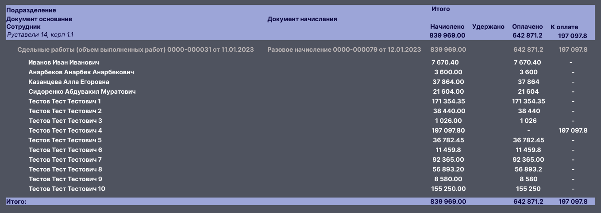
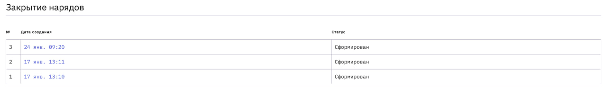
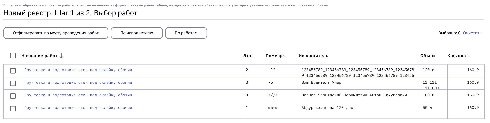

To do:

> Необходимо добавить почасовые работы:
> - добавить в таблицу units единицу измерения "час"
> - добавить в список работ следующие 9 работ:
>   - Ремонт наливного пола ЛК (ЧАС)
>   - Монтаж панелей албес после демонтажа смежниками (ЧАС)
>   - Монтаж подрезков плитки и кабанчика (ЧАС)
>   - Зачеканка некратных мест (ЧАС)
>   - Замазка штроб и подрозетников (ЧАС)
>   - Подготовка под покраску калошницы ЛК (ЧАС)
>   - Мелкие работы по подвалу (ЧАС)
>   - Шлифовка ступеней ЛК (ЧАС)
>   - Реставрация (ЧАС) - данныq пункт обобщает все доработки/исправления работ после смежников, доделки мелкие, пусть тоже будет.

To do:

> - Расценки выставляются индивидуально для каждого мастера (БД, front, back).
> - При выдаче доступа из пользователей надо убрать Имя и Должность - в них нет смысла, они все равно заменятся системными, можно указывать только телефон.
> - При формировании наряда надо сделать фильтр по сдельным и почасовым работам - то есть "Фильтр по единицам измерения" для работ.
> - Файл наряда должен со временем стать pdf вместо xlsx, либо поддерживать оба формата.  
> - Процентовка в реестрах не нужна, а в нарядах нужна, так будет понимание по качеству.
> - В идеале, можно переименовать некоторые статусы тасок, т.к. названия немного нечитабельные и все разнородные, некоторые устарели.
> - В шахматке закрашенным образом нам хотелось бы видеть **прогресс по таске целиком** (а не прогресс по объему работ, выданных исполнителю на **текущую** неделю) - поэтому в полях "Выдано работ" и "Выполнено" хотим попросить пользователя поддерживать именно кумулятивну картину по работам.
> - Насколько сильно нас напрягает, что статус саб-тасок и нарядов, их породивших, всегда совпадает?
> - Зачем в payment_report_task нужны комната и этаж - нам вроде бы всегда достаточно id таски для всех задач? (нет функционала отвязки таски от объекта, этажа, комнаты)

To do:

> - Необходимо реализовать "Статус наряда" с возможностью для пользователя ("Редактирование" / "Владелец") их менять ("Сформирован" / "Оплачен" / "Удален"~~/ м.б. позже добавится "Отправлено на оплату"~~). 
> - Статус 'ReadytoPay' необходимо убрать из рабочих статусов тасок.
> - Для реализации частичной оплаты необходимо ввести сущность "подзадача" / sub-task (на базе payment_report_task), к которой необходимо добавить статус ("Не оплачена" / "Оплачена").   
> - Подзадача (сабтаска) заводится при создании наряда (как правило, их заводится сразу помногу).
> - По умолчанию статус сабтаски - "Не оплачена". По умолчанию статус наряда - "Не оплачен".
> - Если статус наряда меняется на "Оплачен", всем сабтаскам в его составе проставляется статус "Оплачена".
> - Если статус наряда меняется на "Не оплачен", всем сабтаскам в его составе проставляется статус "Не оплачена".
> - Если статус наряда меняется на "Удален", всем сабтаскам в его составе проставляется статус "Удалена" ~~(возможно, их тогда надо просто совсем стирать, надо обсудить)~~.
> - Подзадачи (сабтаски, сущность для реализации частичных оплат), статус которых "Оплачена", будут высвечиваться в боковой панели интерфейса при работе пользователя с основными тасками.

To do "Обучение пользователя":
> - Так как пользователь должен перед созданием наряда сам все интересующие его работы перевести в статус "Завершено", а также проставить объемы и исполнителей, хорошо бы его этому обучить.  
> - Необходимо обучение пользователя работе с фильтром по "сдельным" и "почасовым" работам (по единицам измерения).  
> - Пользователю надо объяснить, что в боковой панели он вводит не задание исполнителю на неделю, а общую цифру по всем исполнителям данной работы! Чтобы проще понимать прогресс по помещению, этажу, секции.

### Одна пользовательская история:

> Сразу приведем корнер-кейс, который имеет смысл держать в виду.  
> 1. ПРИМЕР КОЛЛИЗИИ, с которой система должна успешно справиться: 
>     - Пользователь закрыл наряд за 1-7 число месяца (статус наряда №1 "Оплачено).
>     - Пользователь закрыл наряд за 8-14 числа месяца (статус наряда №2 "Оплачено).
>     - Сегодня 22 число того же месяца. Пользователь закрывает наряд за 15-21 числа месяца (статус наряда №3 "Оплачено")
>     - Пользователь переводит наряд №2 в статус "Сформирован" или в статус "Удален".
>     - Итог: система должна не дать пользователю закрыть наряд за 8-21 число, ТОЛЬКО за 8-14! 
>     - Также если позволить создавать наряды в неограниченном количестве и не осуществлять поиск доублей для одного и того же дна: по каждому новому наряду будет создаваться груда подтасок.

Обработка коллизий в боковой панели, связанных с вводом статусов оплаты у нарядов/реестров (предложения):

> 2. Если часть работ оплачена, но пользователь хочет уменьшить в боковой панели объем **выполненной работы** до значения, которое меньше объемов, за которые уже заплачено:
>     - В момент сохранения данных для помещения нужна нотификация с обратной связью (в духе "У вас сейчас случится перерасход или введено ошибочное значение для объема выполненных работ"), так как система стала неконсистентна - пользователю нужно либо скорректировать данные по помещению, либо перевести статус одного из оплаченных реестров в notPaid;
>     - рядом с полем "Выполнено" теперь должен гореть знак, например, небольшой (!), подсвечивающий перерасход.
> 3. Если часть работ оплачена, но пользователь хочет уменьшить в боковой панели объем **дефектовки** до значения, которое меньше объемов, за которые уже заплачено:
>     - В момент сохранения данных для помещения возникает Нотификация "У вас перерасход или ошибка!";
>     - рядом с полем "Дефектовка" должен теперь гореть знак (!), подсвечивающий перерасход.

 

## Наряды и реестры на выплату. Частичное закрытие работ

## Введение и определения

1. **Наряд** - таблица, отражающая объёмы любых выполненных работ (сдельных, почасовых) за определенный период (обычно за последнюю неделю) одновременно по всем работникам в данной секции. Наряды закрывются технадзорами.  
2. **Реестр на выплату** - документ, формируемый по закрытии наряда руководителем координации - человеком, который их проверяет и уже сам отправляет в бухгалтерию - с указанием в нем сумм к выплате, например:

| ФИО                       | Начислено  | Удержано | Оплачено | К оплате  |
| ------------------------- | ---------- | -------- | -------- | --------- |
| Арутюнян Абдулла Саидович | 1 026,00   |          | 1 026    |           |
| Арутюнян Анна Иванована   | 197 097,80 |          |          | 197 097,8 |

В реестре на выплату:  
- ФИО каждого мастера/бригадира/подрядчика встречается 1 раз;  
- содержится информация только о причитающихся человеку суммах;  
- Имеет строку с подытогом по всем сотрудника.  

Далее реестр на выплату идет в бухгалтерию, в проводки.  

Работы бывают: **сдельными** (подавляющее большинство) и **почасовыми**. Почасовые работы, как правило, представлены мелкими доработками. К почасовым работам прибегают не на каждом объекте.  
Технически работу сдельщиков и часовщиков мы реализуем (в тасках, отчетах, нарядах, реестрах и пр.) одинаково. Их разделение при закрытии нарядов реализуется через выставление соответствующих фильтров.

Каджая работа должна быть закончена и оплачена. Однако, она может делаться по частям (более одной недели) и даже каждую неделю иметь нового исполнителя. Процесс частичной оплаты труда иногда называют **процентовкой**, иногда - **частичным закрытием наряда**.

### О реестрах, нарядах и отчетах

**Реестр на выплату**:

"Реестр на выплату" - это финансовая выжимка на основе наряда.  
"Оплаченная часть работ" - связующее звено между нарядами и реестрами на выплату. Связь между нарядами и реестрами получается очень жесткой, поэтому реестр - просто форма представления наряда - основной сущности с детализацией.

**Пример наряда в процессе заполнения:**

| № | Дата подачи | Секция | Этаж | Тип помещения | Вид работ по ведомости | Вид работ по 1С | Выполненный объем | Всего | Остаток | Ед. изм | Исполнитель | Тип работы | Кол-во часов при по часовой работе|
|-|-|-|-|-|-|-|-|-|-|-|-|-|-|
|1|25.01.2023|Секция 2|7|Квартира|Шпатлевка стен|Подготовка под финишное покрытие стен (шпатлевка по ГКЛ) (Шпатлёвка стен по ГКЛ с грунтованием (МОП, Квартиры, СТК, и дверные перемычки))||120,58900|32,77600|м2| | | |
|2|25.01.2023|Секция 2|8|Квартира|Шпатлевка стен|Подготовка под финишное покрытие стен (шпатлевка по ж/б, штукатурке)/ шпаклевка с ошкуриванием||590,47600|0,00000|м2||||			
|47|25.01.2023|Секция 4|12|МОП|Укладка керамогранита на пол|Укладка керамогранита на пол|8,00000|78,20000|8,00000|м2|Петров Иван Сидорович|Сдельная||
|48|25.01.2023|Секция 4|9|МОП|Установка плинтуса из керамогранита|Установка плинтуса из керамогранита|82,00000|82,00000|0,00000|м.пог.|Петров Иван Сидорович|Сдельная||

**Отчет**

"Отчет" - это таблично-текстовая развертка всей актуальной информации о шахматке на **текущий** момент времени с сылками на актуальные работы, исполнителей и т. д. Периодов и дат нет. 

> Сейчас нас будут интересовать только наряды. Отчеты уже в некотором виде реализованы, а реестр на выплату может быть легко сгенерирован на базе наряд в последующих релизах.

## Требования к НАРЯД (в рамках списка нарядов):

Одно из ключевых свойств наряда - его неизменность: никакие его данные невозможно редактировать, кроме Статуса ("Сформирован", "Оплачен", "Удален") и Названия (по умолчанию "Наряд № [3] от [24 января 2023]").  
В наряде нигде не используются ссылки на какие-либо сущности БД, потому что наряд - слепок определенного состояния шахматки за определенное время.  
В настоящее время удаление наряда пока невозможно ни из UI, ни напрямую из БД.  

### Атрибуты наряда

| №   | Название                 | Комментарий                                        | Изменяемое? |
| --- | ------------------------ | -------------------------------------------------- | ----------- |
| 1   | **Номер наряда**         | Натуральное число для удобства нумерации в UX      | -           |
| 2   | **Дата-время создания**  | Дата-время создания наряда                         | -           |
| 3   | **Начало периода**       | Поле "За период" - стартовая дата-время            | -           |
| 4   | **Окончание периода**    | Поле "За период" - дата-время окончания периода (пока совпадает с датой создания) | -           |
| 5   | **id создателя**         | uuid автора                                        | -           |
| 6   | **ФИО автора**           | Как автор наряда звался на момент создания наряда у себя в учетной записи (сейчас совпадает с именем, как отображается у владельца шахматки) | -           |
| 7   | **Должность автора**     | Как записано на момент создания наряда у автора наряда в учетной записи (сейчас совпадает с должностью, как отображается у владельца шахматки) | -           |
| 8   | **Статус**               | "Сформирован" / "Оплачен" / "Удален"               | YES         |
| 9   | **Название наряда**      | Текст в сободной форме, до 255 символов            | YES         |
| 10  | ~~**Дата оплаты**~~      |~~Пока нет смысла отслеживать~~                     | -           |
| 11  | ~~**Тип работ**~~        |~~Решили не разделять наряды по типу работ, используем фильтры~~     | -           |
| 12  | ~~**Ссылка на реестр**~~ | ~~Генерируется на основе данных того же наряда. Пока нам не нужен~~ | -           |
| 13  | **Секция (id объекта)**  | К какому объекту относится наряд (project_id) |

- Пока считаем, что дата создания наряда совпадает с конечной датой того периода времени, за который формируется наряд.
- Если будем делать просмотр "Реестров на выплату": вполне возможно сделать его по-другому, например, доступным изнутри конкретного наряда (но добавится лишний клик).   

 

**Как сейчас:**  

**Пример реализации с учетом требований:**  

 

## Требования к РАБОТА (отображение внутри наряда)

**Сейчас** наряд - это список работ, которые:
1. находятся в рабочем статусе «Завершено»,
2. у них указаны Исполнители,
3. у них указаны выполненные объёмы,
4. они **не попали в сформированные ранее наряды**.

> - Больше одного раза пользователь задачу в наряды положить не может;  
> - В помещении больше одной работы данного типа быть не может (и не надо).

**Требуется**, чтобы в наряды попадали работы, обладающие свойствами:
1. находятся в рабочем статусе «Завершено»,
2. у них указаны Исполнители,
3. у них указаны выполненные объёмы
4. в **объемах** выполненной работы есть **изменения относительно предыдущих закрытых нарядов** ("закрытый наряд" = находятся в статусе  "Оплачен" ~~или "Отправлен на оплату"~~). Говорим здесь только про поле "Объем" (изменения в полях "Всего" (дефектовка) или "Остаток" (что останется на следующую неделю) или сколько "Выдано" исполнителю или любых других системе безразличны).

> - Многократное попадание работы в разные наряды позволит не пересоздавать работу в случае частичного выполнения, а продолжить работу с той же сущностью.  

### Атрибуты работы

| №   | Название                                                        | Комментарий                                                                            | Изменяемое? |
| --- | --------------------------------------------------------------- | -------------------------------------------------------------------------------------- | ----------- |
| 1   | **Исполнитель** / **Сотрудник**                                 | ФИО мастера                                                                            | -           |
| 2   | **Вид работ** / **Вид работ по ведомости**                      | Как в шахматке (как у подрядчика)                                                      | -           |
| 3   | ~~**Вид работ по 1С**~~                                         | ~~Как в бухгалтерии у закачика, напр. у "ПИК"а - будет позже~~                         | -           |
| 4   | **Единица измерения**                                           | Выносятся отдельно ради сортировки и фильтрации                                        | -           |
| 5   | **Тип помещения**                                               | "Квартира" / "МОП" / "ЛК" / "ЛХ" / "Вестибюль"                                         | -           |
| 6   | **Этаж**                                                        | Storey                                                                                 | -           |
| 7   | **Помещение**                                                   | Она же "Ячейка". Иногда в ней пишут всякий ад: "Тамбур1,2,3" или "3,4,5,16эт 8кв" или "3-5,16кв8" или "МОП01,06" или "19-22, 28,30,31МОП", т.к. лень вводить одно и то же. У нас автозаполнение, здесь лежит наименование room group  | -           |
| 8   | **Объем** / **Объем выполненных работ** / **Выполненный объем** | ... мастером за последнюю неделю. Фиксирует технадзор.                                 | -           |
| 9   | **Всего**                                                       | Дефектовка перед началом работы. Данная цифра от наряда к наряду не должна меняться.   | -           |
| 10  | **Процентовка**                                                 | Значение, вычисляемое значение на основе полей "Объем" и "Всего" (отношение в %).      | -           |
| 11  | **Остаток**                                                     | Объем работ, который осталось сделать, начиная со следующей недели.                    | -           |
| 12  | **Расценка**                                                    | Удельная стоимость работы для данного исполнителя.                                     | -           |
| 13  | **К выплате**                                                   | Произведение расценки на объем.                                                        | -           |

 

**Как сейчас:**

**Шаг 1**:

**Шаг 2**:

 

**Пример реализации с учетом требований:**

**Шаг 1**:

На шаге 1 формирования наряда со временем надо отражать больше информации:
- **подтянуть последние 3 ссылки на предыдущие наряды по этому объекту, ушедшие на оплату**.
- **за какой диапазон дат создается наряд** (+ сколько в итоге дней накапало) - на основе данных последнего **закрытого наряда**.
- какой это объект (секция) - иначе распечатают и забудут
- кто создает
- ~~возможность задать имя~~
- **на данной иллюстрации не отрисованы фильтры, фильтры тоже должны быть**.

**Шаг 2**:

На шаге 2 внимание:
- договоренности по оплате с разными работниками разные!

**Шаг 3**:

У сформированного наряда
- можно изменять **Название**
- можно изменять **Статус оплаты**.
    - Если наряд имеет статус "Оплачен", то все подзадачи, входящие в него, имеют статус "Оплачена".
    - Если наряд имеет статус "Не оплачен" / "Сформирован", то все подзадачи, входящие в него, имеют статус "Не оплачена".
    - Если наряд имеет статус "Удален", то все подзадачи, входящие в него, имеют статус "Удалена".
- В будущих релизах будут отображены перерасходы.

## Сортировка и фильтрация в нарядах

При создании наряда (называется пока "реестр на выплату", но это именно наряд):
- поддерживается **сортировка** на двух этапах:
    - при его создании на **Шаге 1** в списке работ-задач;
    - в готовом наряде.  
- поддерживается **фильтрация**:
    - при создании наряда на **Шаге 1** в списке работ:  
        - по месту проведения работ;
        - по исполнителю;
        - по работам;
        - по единицам измерения.

По какому принципу осуществляется сортировка:

| N   | Поле таблицы               | Принцип                       |
| --- | -------------------------- | ----------------------------- |
| 1   | **Исполнитель**            | По алфавиту: ASC, DESC        |
| 2   | **Вид работ по ведомости** | По алфавиту: ASC, DESC        |
| 3   | **Вид работ по 1С**        | По алфавиту: ASC, DESC        |
| 4   | **Этаж**                   | по полю *level*               |
| 5   | **Помещение**              | по полю *number*              |
| 6   | **Тип помещения**          | По алфавиту: ASC, DESC        |
| 7   | **Объем**                  | алф (будут только числа)      |
| 8   | **Всего**                  | алф (будут только числа)      |
| 9   | **Процентовка**            | алф (будут только числа)      |
| 10  | **Остаток**                | алф (будут только числа)      |
| 11  | **Единица измерения**      | По id (если не придем к uuid) |
| 12  | **Расценка**               | алф (будут только числа)      |
| 13  | **К выплате**              | алф (будут только числа)      |

## Частичная оплата работ

Для "**Частичной оплаты работ**" необходима структура, поддерживающая вложенность "оплаченных частичных работ" в "основные работы (/задачи/таски)".  

Возможно реализовать учет по-разному, например:
- Каждую неделю текущие таски закрываются и пересодаются таски на остаток - тогда раз в неделю, фактически, вся шахматка целиком принудительно обновляется (будет сложно версионировать? Сложно читать логи? Сложно проводить аналитику? зато не нужно вводить новые сущности);
- Поддерживать две сущности - "работа" (пустой контейнер, в котором всегда лежит как минимум одна частичная работа) и "частичная работа" (основная сущность со всеми статусами "Ожидает дефектовку"/.../.../.../"Завершено"/"Готово к оплате"), тогда подзадачи - основная сущность, а таска только собирает их вместе, обеспечивая читаемость процессов;
- Поддерживать две сущности - "работа" и "частичная работа" (/подработа/саб-таска/sub-task), и **вложенной подтаске делегировать только статус об оплате**; остальные свойства остаются с основной таской.  

**Предлагается пойти по третьему пути** (тем более, структура с таблицей **payment_report_task** близка к этому решению).  

> Не принципиально, как хранить всю конструкцию в БД - создать ли отдельную таблицу под саб-таски с полем под родительскую таску; создать ли отдельную таблицу для связей таски-сабтаски; просто хранить одну таблицу с "транзакциями" оплат. Необходимо обсуждение? 
> В любом случае возникает много коллизий, связанных с пересечением дат.

> - Взаимосвязи **статуса оплаты** со с**татусом выполнения** работ нет.  
> - Внутри каждого из статусов разрешены переходы из любого состояния в любое состояние.

Тогда статусы оплаты и прогресса работ разделятся:

- **Статус оплаты** частичных работ (**payment-status** у сабтаски, или payment_report_task):

| Database         | UI                                                                              |
| ---------------- | ------------------------------------------------------------------------------- |
| 'notPaid'        | 'Сформирован' - работа еще не оплачена. Дефолтное состояние на старте формирования наряда. |
| ~~'readyToPay'~~ | ~~'Отправлен на оплату' (потребуется ближе к 1С, но можно и сразу внедрить)~~ |
| 'paid'           | 'Оплачен' - пользователь переводит подтаски в этот статус вручную при смене статуса наряда с 'Не оплачен' на 'Оплачен'. ~~При интеграйции с 1С факт оплаты может быть проставлен автомтачиеки.~~ | 
| 'deleted'        | 'Удален' - статусы частичных работ дублируют статусом соответствующего наряда для ясности, но прикладного смысла у данного статуса нет (можно было бы отличать только черновики от оплаченных документов) |     

- **Статус выполнения** работ (**progress-status** у таски):

| Database                          | UI                                |
| --------------------------------- | --------------------------------- |
| 'volumeEdit'                      | 'Ожидает дефектовку'            |
| 'draft'                           | 'Готово к работе'               |
| 'inProgress'                      | 'В работе'                      |
| 'readyToCheckTechnicalSupervisor' | 'Ожидает технадзор'             |
| 'hasRevisions'                    | 'Есть замечания'                |
| 'completed'                       | 'Завершено'                     |

**Из минусов - такой подход каждому новому наряду будет создавать груду подтасок.** - нет
!!!!!!
**Если под-таска на неделю уникальна, то она же может войти в несколько нарядов. Если у этих нарядов будут противоречащие статусы, то какой статус будет у саб-таски? Самый последний? Самый оплаченный?** так что лушче подерживать уникальность частичных работ сквозным образом!

1. Если у сабтаски есть в каком-то наряде положительный статус об оплате, ее больше нельзя включить ни в один наряд! Это очень важно.
2. Один рабочий день может войти в одну и только одну саб-таску!
3. Статус наряда и ~~статус~~ саб-таски не одно и то же.
4. При создании наряда сначала устанавливаются даты, за которые наряд будет сформирован.
5. У саб-таски есть конкретный день, за который она отвечает!
5. Все саб-таски, которые полностью ложаться в диапазон дат наряда, попадают в наряд.
6. Все саб-таски, которые полностью лежат вне наряда, не попадают в наряд.
7. Все саб-таски, которые частично попадают в диапазон дат для наряда, также отражаются в наряде.
8. То есть у саб-таски должна быть элементарная единица измерения труда и оплаты. Это день. 
9. В общем, нужна новая таблица - саб-таски. Каждая сабтаска отвечает ровно за один день, одну работу, одно помещение (этаж и объект прилагаются автоматически). У нее может есть поле исполнитель. и ПР. В общем в этой таблице есть только id-таски и день, за который она отвечает, и статус - оплачена она или нет. Все.
10. Каждый раз при создании наряда у нас на базе неоплаченных саб-тасок формируется список для payment_report_task.
11. Как только статус для наряда становится оплаченным, а значит оплаченным становится payment_report_task, всем включенным в него саб-таскам тоже выставляется статус оплачено.
12.

### Атрибуты частичной работы (sub-task)

### Атрибуты payment_report_task

К полям таблицы payment_report_task, как минимум, необходимо добавить статус оплаты, чтобы при отображении лимитов и перерасходов в боковой панели пользователя учитывать только реально состоявшиеся в бухгалтерии проводки.
Какая информация требуется для корректного описания payment_report_task:

| Имя                   | Комментарий                                                                                                                                                             |
| --------------------- | ----------------------------------------------------------------------------------------------------------------------------------------------------------------------- |
| task_id               | По какой работе (задаче, таске) выполняются взаиморасчеты? Должна удаляться при удалении соответствующей таски.                                                         |
| ~~work_id~~           | ~~id работы~~                                                                                                                                                           |
| ~~price_id~~          | ~~id расценки за работу на момент проведения взаиморасчетов~~                                                                                                           |
| ~~payment_date~~   | ~~Дата проведения оплаты может не совпасть с датой формирования наряда и не совпасть с датой окончания расчетного периода, но первые две нам по-настоящему, не интересны~~ |
| ~~worker_id или user_id~~ | ~~Зависит от очередности реализации нами данной фичи и работы с пользователями и доступами - сейчас user_id, но по-хорошему сразу должен быть worker_id~~           |
| work_name             | Наименование работ                                                                                                                                                      |
| worker_name           | ФИО исполнителя                                                                                                                                                         |
| volume                | Объем произведенных работ (как записано в родительской таске на момент подачи наряда на оплату МИНУС все предыдущие оплаченные объемы)                                  |
| total_price           | Общая сумма выплат за проведенную работу. Расценку на момент проведения взаиморасчетов можно вычислить отсюда.                                                          |
| status                | Статус, отоображающий, была ли данная часть работы уже в реальности оплачена или нет ("Сформирована" / "Оплачена")                                                      |

А вот зачем в payment_report_task нужны комната и этаж - не понятно. Нам вроде бы всегда достаточно id таски для всех задач (нет функционала отвязки таски от объекта, этажа, комнаты)

### Отображение оплаченных payment_report_task в боковой панели

Как (примерно) сабтаски будут показаны при подсчете лимитов в боковой панели шахматки:
 

## Требования

1. Пользователь с правами доступа "Редактирование" или "Владелец" может создать новый наряд. Заполняемые атрибуты нового наряда:
    - Номер наряда
    - Дата-время создания (пока совпадает с окончанием расчетного периоа)
    - Начало расчетного периода:
        - проставляется системой автоматически по последнему закрытому наряду;
    - Окончание расчетного периода:
        - проставляется системой автоматически - сейчас текущая дата;
    - author_id - идентификатор создателя
    - ФИО автора
    - Должность автора
    - Статус (по умолчанию "Сформирован")
    - Секция (id объекта)
    - Название
2. Пользователь с правами доступа "Редактирование" или "Владелец" может менять статус наряда:
    - "Сформирован", "Оплачен", "Удален".
    - Нужна где-то жирная кнопка - пол статус наряда делаем "Оплачен".
3. По умолчанию саб-таски имеют статус "Не оплачена".
4. Если наряд имеет статус оплачено, то все подзадачи (саб-таски), входящие в него, имеют статус "Оплачена".
5. Пользователь с правами доступа "Редактирование" или "Владелец" может редактировать название наряда:
    - название по умолчанию "Наряд № (3) от (24 января 2023)".
    - По умолчанию "Комментарий" / "Имя наряда" будет "Реестр на выплату № ХХХХХ от YYYY января 2023".
6. Пользователь с правами доступа "Чтение", "Редактирование" или "Владелец" может просматривать список всех нарядов, прикрепленных к данной шахматке (т. е., секции, объекту).
7. Пользователь с правами доступа "Чтение"/"Редактирование"/"Владелец" может:
- просматривать наряды данной шахматки 
- осуществлять сортировку данных
- ~~видеть саб-таски, сопряженные с перерасходом материалов~~.
8.  Взаимосвязи статусов друг с другом нет: разрешены переходы из любого состояния в любое состояние.

При создании нового наряда:  

9. Система должна предоставлять пользователю возможность быстро сбросить все фильтры вместе.  
10. Система должна предоставлять пользователю возможность быстро сбросить каждый из фильтров по отдельности.  
11. Система должна предоставлять пользователю возможность добавить работы, которые он видит, к списку выбранных.  
12. Система должна отображать число работ, выбранных пользователем (может быть больше тех, что он видит).  
13. Система должна позволять пользователю установить расценки для каждой из работ индивидуально для каждого исполнителя - из числа связанных с выбранными задачами (Если мы нашли 100 задач за эту неделю, и они все относятся к одному из 5 наименований работ и были выполнены одним из 15 исполнителей, то максимум, сколько расценок нам система предложит внести - это 15*5 = 75 расценок. Из этого декартова произведения отображаются только те, которые друг с другом связаны через реальную актуальную задачу, которую пользователь хочет отразить в наряде).  
14. При запросе расценок у пользователя система предзаполняет все расценки, которые может, на основе последних данных.  
15. После подтверждения пользователем расценок, они обновляются в базе для данного наименования работ и данного исполнителя.  

Доп. требования по работам и частичному закрытию работ

16. Если дефектовка не указана или выданный объем работ не указан, то значения атрибутов работ "Процентовка", "Всего", "Остаток" недоступны.
17. Для почасовых работ в наряде поля "Процентовка", "Всего", "Остаток" всегда недоступны.
18. В боковой панели, если работа выбрана почасовая, а значение поля "Всего" заполнено, рядом должна гореть подсказка, что для почасовых работ нет плана.
17. Если у нас перерасход (Значение поля "Объем" больше значения поля "Всего"), наряд должен это отражать - соответствующая работа должна быть подсвечена (красным)? Тем не менее, в наряд такие работы попасть обязательно должны, как и все остальные, если новый объем работ у нас больше, чем объем работ в последнем созданном наряде. 
18. В нардяы попадают только работы в статусе "Завершено" (пользователь рукамми проставляет).  

6. КАЖДЫЙ РАЗ, когда ПОЛЬЗОВАТЕЛЬ (СОЗДАТЕЛЬ ИЛИ РЕДАКТОР) создает наряд, система должна создавать подтаски, если не сказать, что существовать они должны вообще с самого начала.
    - в наряд попадает подтаска, имеющая параметры, как указано прямо сейчас в таске.
    - когда саб-таска создается, ее статус сразу становится оплаченной, и она сразу начинает учитываться в метриках по родительской таске.
    - Этот статус оплаченной подтаски можно и отменить. сабтаска тогда сразу перестает существовать.    
7. Каждый раз, когда пользователь меняет в боковой панели объем готовых работ, он не может их уменьшить, если у него есть проводки по данной таске в нарядах!!!
8. Пользователь может переводить статус некоторых подтасок в ~~"Кандидат на оплачено" или даже сразу~~ "Оплачено" ручками, когда посылает закрываемый наряд координирующему лицу или в бухгалтерию. Все подтаски внутри него во-первых, создадутся, а во-вторых сразу получат статус "Оплачено" (а других, выходит, и не нужно иметь).
9. Если работа находится в статусе выполнения «Завершено», это не значит, что потом нельзя ее перевести в другой статус. Можно - в любой.  
10. При этом перевод статусов оплаты должен быть строгим (то есть перевод статуса наряда, вместе со всеми его подтасками)! При смене статуса наряда руками дожна вылезать модалка с подтерждением (или должен быть оч. строгий сопровождающий текст) - мол работы этого наряда будут учитываться как получившие полную или частичную оплату! А если отменяем статус оплачено: работы этого наряда больше не будут считаться оплаченными, что повлечет мол за собой недоразумения и коллизии различные в шахматке и боковой панели.
- Все сабтаски должны удалаться при удалении родительской таски.
> - Подзадачи (сабтаски, сущность для реализации частичных оплат), статус которых "оплачена", будут высвечиваться в боковой панели интерфейса при работе пользователя с тасками.

> - Взаимосвязи **статуса оплаты** со с**татусом выполнения** работ нет.  
> - Внутри каждого из статусов разрешены переходы из любого состояния в любое состояние.

1. Номер наряда - для каждого нового наряда это следующее натуральное число.
2. Если когда-либо будет реализовано удаление наряда (жесткое, прямо из базы), все равно номер продолжает возрастать по отношению к максимальному текущему номеру среди существующих нарядов для данного объекта.
3. При смене данных шамхатки, тасок, пользователей и пр. - данные в наряде не меняются.
4. Если когда-то будет поддержка алиасов для пользователей - а нарядах нам все равно нужно сквозное отображение авторов - все редакторы друг друга должны все идентифицировать однозначно. Это поинт в пользу того, что вообще не нужны нам алиасы.
1. При ппролистывании наряд вниз, заголовки должны прилипнуть к верхней части экрана.
4. Система должна предложить отменить перевод статуса наряда в течение 5 секунд
7. Ссылка для скачивания реестра на выплату должна быть прицеплена к каждому конкретному наряду.
8. Взаимосвязи статусов друг с другом нет.  
9. Также внутри каждого статус разрешены переходы из любого состояния в любое состояние.

Пока считаем, что дата создания наряда совпадает с конечной датой того периода времени, за который формируется наряд.
**Из минусов - такой подход каждому новому наряду будет создавать груду подтасок.**

Будущие релизы:
- Наряды можно скачать:
    - в pdf
    - в xlsx
- Реестр на выплату можно скачать:
    - в pdf
    - в xlsx
- Наряд должен подсвечивать перерасходы (и возможно вообще статус готовности отображать)

---

**P.S.**
Обычно:  
1. **Заказ-наряд (наряд)** - формируемый перед началом работ документ, содержащий название-описание предстоящих работ для конкретного работника (обычно на ближайшую неделю), в которой ставится его подпись и подпись выдавшего работу начальника (прораба, мастера участка). В конце, после выполнения работ, подпись в наряде также ставит приемщик работ (технадзор) и в конце кто-то из бухгалтерии. Наряд - это срез вдоль работ в определенный момент времени.  
Обычно в ПИК эта формальная процедура опускается: наряды раздаются людям в устрой форме в штабе.  
2. **Табель** - таблица учета почасовых (поденных, повременных и пр.) работ; вид работа один и тот же. Табель - это срез вдоль времени для конкретной работы. Также табель - это уже закрытый график по часам за период.  
3. На основании наряда или табеля в 1С создаются **ведомости на счета** ("ведомость на выплату заработной платы на счета сотрудников") и **начисления**.

> В нарядах для каждого помещения необходимо отразить тип помещения. Но пользователь может указывать их самостоятельно - строкой! Поэтому ничего не делаем:
> - "Квартира",
> - "МОП",
> - "ЛК",
> - "ЛХ",
> - "Вестибюль".

